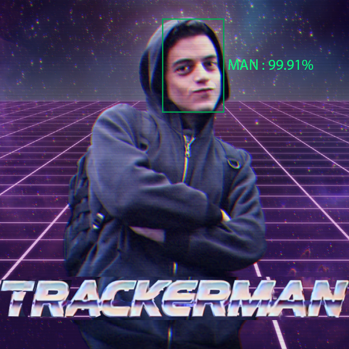

  

# Implementation of "Globally-optimal greedy algorithms for tracking a variable number of objects"

## Sample of tracking for single object

  

## Sample result for Tracking with DP without NMS

  

## Sample Results for multiple objects
https://youtu.be/K1Uouo-hXp0
